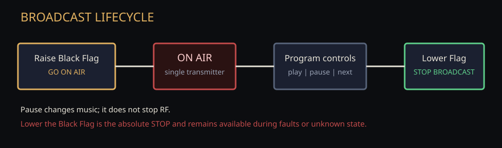

# Hardware and first run

piFM is one product with evidence-based hardware profiles. A profile adapts
GPIO, transmitter compatibility, networking expectations, optional controls,
and host prerequisites; it does not create a separate edition.

## Hardware evidence

- **SUPPORTED:** physically validated for the complete piFM path.
- **EXPERIMENTAL:** technically plausible or upstream-supported, but not fully
  validated by this project.
- **UNSUPPORTED:** a known architecture mismatch prevents the current
  transmitter path from working safely.
- **UNKNOWN:** no project evidence is available. piFM does not guess.

The Raspberry Pi Model A+ Rev 1.1 is the minimum and reference **SUPPORTED**
board. No other Raspberry Pi model is promoted to supported by P1F.

## Model A+ prerequisites

The reference A+ uses PiFmRds on GPIO 4 / physical pin 7. Physical timing was
validated with a headless `multi-user.target` boot, onboard audio disabled, and
`pi_fm_rds_ppm = 0.0`. Desktop/onboard-audio PWM ownership previously produced
approximately half-speed audio.

Read the host without changing it:

```sh
./scripts/hardware-readiness.py
```

Preview the only currently supported automatic configuration:

```sh
./scripts/configure-hardware.sh
```

On a detected Model A+, an operator may explicitly apply the reversible change:

```sh
sudo ./scripts/configure-hardware.sh --apply
```

The command backs up `/boot/config.txt` and the default systemd target under
`/var/lib/pifm/hardware-backups/`, writes a rollback script there, and never
starts PiFmRds. It refuses to modify unknown hardware.

## First run

Fresh installations open a five-step setup:

1. Welcome
2. automatically detected hardware and readiness
3. frequency and basic RDS station identity
4. browser music import
5. Broadcast Deck handoff

Existing configurations without the P1F setup key are treated as already set
up, preserving upgrade behavior. Finishing setup remains OFF AIR.

## Original diagrams




The diagrams identify the software and reference wiring, not a compliant
finished transmitter. Filter design, antenna/load, emissions, authorization,
and local law remain operator responsibilities.
